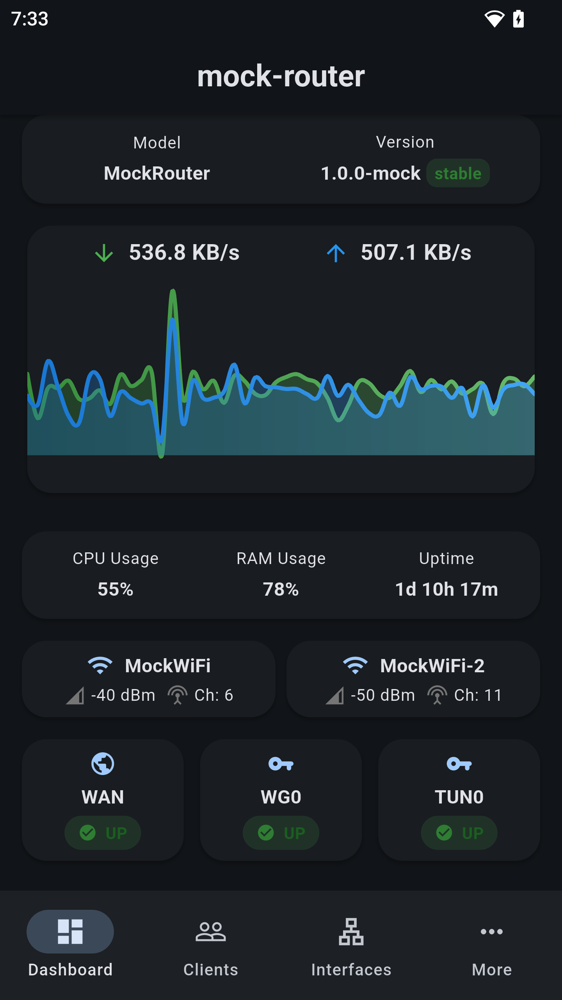

# LuCI Mobile

A modern Flutter mobile application for managing OpenWrt/LuCI routers remotely. LuCI Mobile provides an intuitive interface to monitor and control your router's network interfaces, connected clients, and system status.



## Features

### 🔐 Secure Authentication
- Secure login with username/password
- Support for both HTTP and HTTPS connections
- Self-signed certificate handling
- Persistent session management

### 📊 Dashboard Overview
- Real-time system statistics
- Network interface status monitoring
- Connected clients overview
- System uptime and performance metrics
- Interactive charts and visualizations

### 🌐 Network Interface Management
- View all network interfaces (wired and wireless)
- Monitor interface status (up/down)
- Track bandwidth usage and statistics
- View IP addresses, netmasks, and gateways
- DNS server configuration display

### 👥 Client Management
- Comprehensive client list with detailed information
- Connection type detection (wired/wireless)
- MAC address and IP address tracking
- Hostname and vendor information
- DHCP lease time monitoring
- Active connection time tracking

### ⚙️ System Control
- Remote router reboot functionality
- System settings management
- Theme customization (light/dark mode)
- Secure storage for credentials

### 📱 Modern UI/UX
- Material Design 3 implementation
- Dark and light theme support
- Responsive design for various screen sizes
- Intuitive navigation with bottom navigation bar
- Real-time data updates

## Screenshots

| Login Screen | Dashboard | Clients | Interfaces |
|--------------|-----------|---------|------------|
|  |  |  |  |

## Prerequisites

- Flutter SDK (version 3.8.1 or higher)
- Dart SDK
- Android Studio / Xcode (for mobile development)
- OpenWrt router with LuCI web interface enabled

## Installation

### 1. Clone the Repository
```bash
git clone https://github.com/cogwheel0/luci-mobile.git
cd luci-mobile
```

### 2. Install Dependencies
```bash
flutter pub get
```

### 3. Configure Your Router
Ensure your OpenWrt router has:
- LuCI web interface enabled
- UCI RPC interface accessible
- Proper firewall rules for mobile access

### 4. Build and Run

#### For Android:
```bash
flutter build apk
# or for debug
flutter run
```

#### For iOS:
```bash
flutter build ios
# or for debug
flutter run
```

## Usage

### Initial Setup
1. Launch the app
2. Enter your router's IP address
3. Choose HTTP or HTTPS connection
4. Enter your LuCI username and password
5. Tap "Connect" to authenticate

### Navigation
- **Dashboard**: Overview of system status and statistics
- **Clients**: View and manage connected devices
- **Interfaces**: Monitor network interfaces and their status
- **More**: Additional settings and system controls

### Managing Clients
- View all connected devices with their connection type
- Monitor DHCP lease times and active connections
- Identify wired vs wireless connections
- Track device vendor information

### Monitoring Interfaces
- Check interface status (up/down)
- View IP configuration and routing
- Monitor bandwidth usage
- Track interface uptime

## Technical Architecture

### Project Structure
```
lib/
├── api/                    # API-related utilities
├── models/                 # Data models
│   ├── client.dart        # Client/device model
│   └── interface.dart     # Network interface model
├── screens/               # UI screens
│   ├── dashboard_screen.dart
│   ├── clients_screen.dart
│   ├── interfaces_screen.dart
│   ├── login_screen.dart
│   ├── main_screen.dart
│   ├── more_screen.dart
│   ├── settings_screen.dart
│   └── splash_screen.dart
├── services/              # Business logic services
│   ├── api_service.dart   # LuCI API communication
│   └── secure_storage_service.dart
├── state/                 # State management
│   └── app_state.dart
├── widgets/               # Reusable UI components
│   └── luci_app_bar.dart
└── main.dart             # App entry point
```

### Key Dependencies
- **provider**: State management
- **http**: Network communication
- **flutter_secure_storage**: Secure credential storage
- **fl_chart**: Data visualization
- **package_info_plus**: App information

### API Communication
The app communicates with LuCI using the UCI RPC interface:
- Authentication via `/cgi-bin/luci/`
- RPC calls via `/cgi-bin/luci/admin/ubus`
- Support for both HTTP and HTTPS
- Self-signed certificate handling

## Development

### Running in Development Mode
```bash
flutter run
```

### Building for Release
```bash
# Android
flutter build apk --release

# iOS
flutter build ios --release
```

### Code Analysis
```bash
flutter analyze
```

## Security Features

- Secure credential storage using `flutter_secure_storage`
- HTTPS support with self-signed certificate handling
- Session-based authentication
- Input validation and sanitization

## Contributing

1. Fork the repository
2. Create a feature branch (`git checkout -b feature/amazing-feature`)
3. Commit your changes (`git commit -m 'Add some amazing feature'`)
4. Push to the branch (`git push origin feature/amazing-feature`)
5. Open a Pull Request

## Troubleshooting

### Common Issues

**Connection Failed**
- Verify router IP address is correct
- Check if LuCI web interface is accessible
- Ensure firewall allows mobile connections
- Try both HTTP and HTTPS

**Authentication Failed**
- Verify username and password
- Check if user has admin privileges
- Ensure LuCI authentication is properly configured

**No Data Displayed**
- Check router's UCI RPC interface
- Verify network connectivity
- Review router logs for errors

## License

This project is licensed under the GNU General Public License v3.0 (GPL v3).

## Acknowledgments

- OpenWrt community for the LuCI web interface
- Flutter team for the excellent framework
- Inspired by and with thanks to [OpenWrtManager](https://github.com/hagaygo/OpenWrtManager)
- Contributors and beta testers

## Support

For support, please open an issue on GitHub.

---

**Note**: This app requires an OpenWrt router with LuCI web interface enabled. Make sure your router is properly configured before using this application.
